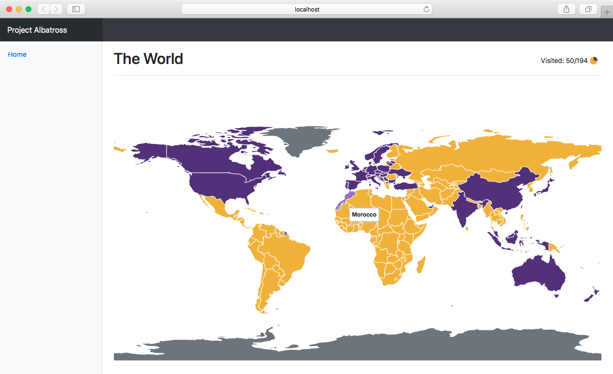
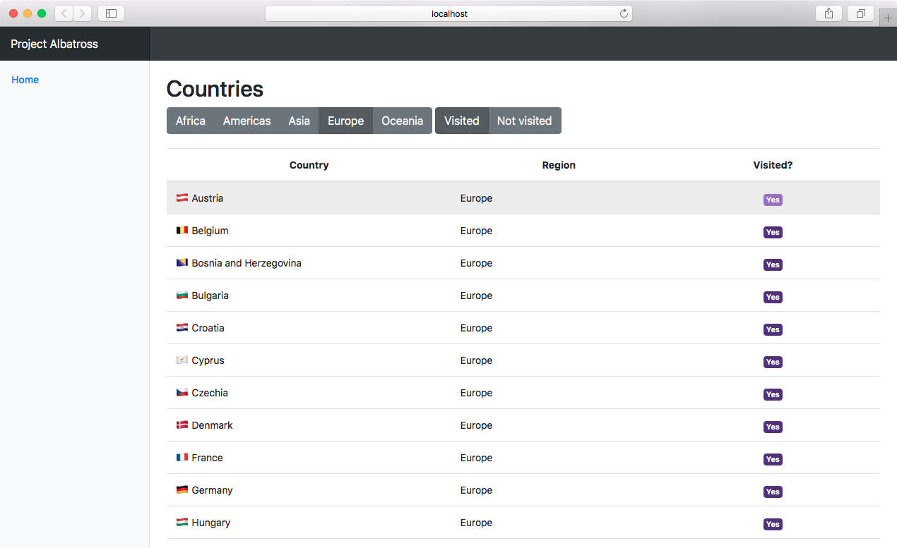

# Project Albatross

There are two things that scare me. One, the thought that I will die before reading all the good books. And two, that I will die before seeing the world. The _entire_ world. I'm pretty sure the first is already decided. No matter how I look at it, there are more good books than I could read in my remaining years. So I try not to think about that too much. When it comes to seeing the world, I still have hope. This is where I track that hope.

## Code
It's a very simple one-page tool that shows you the world and the places you've visited. And let's you quickly update your visited country list. The best part is that you need no databases; your data is stored in a JSON file.

## Libraries
[Bootstrap](https://getbootstrap.com), of course, for making it all pretty. [DataMaps](https://datamaps.github.io/) for displaying the map of the world. And [Peity](https://benpickles.github.io/peity/), the cutest mini library for that pie chart. Country data coming from [mledoze](https://mledoze.github.io/countries/).

## Author
**Ernesta Orlovaitė**

+ [ernes7a.lt](http://ernes7a.lt)
+ [@ernes7a](http://twitter.com/ernes7a)

## Screenshot

